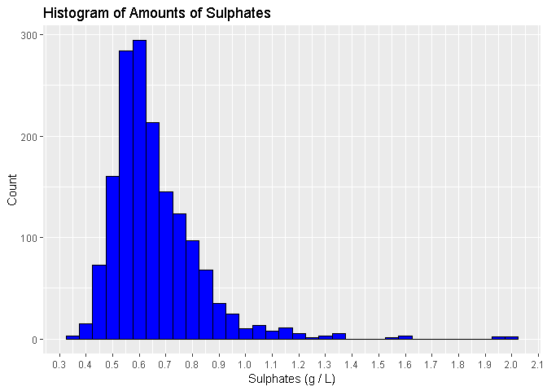
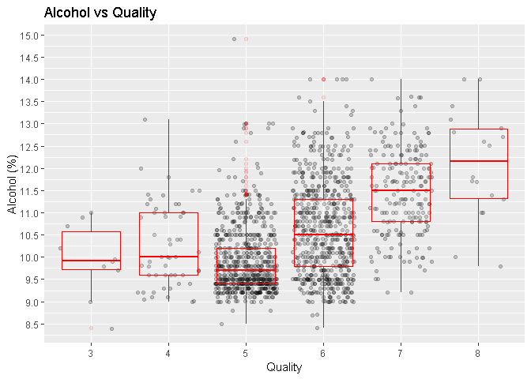
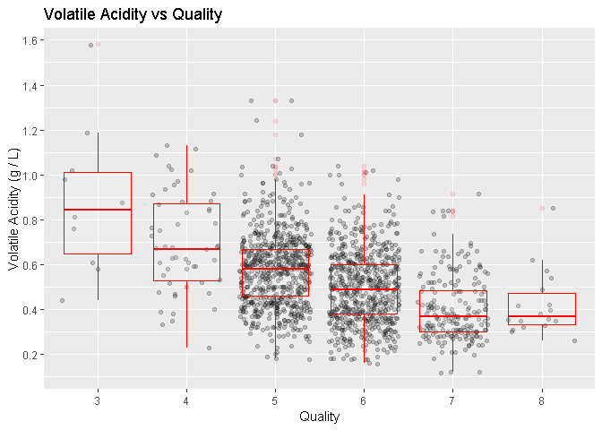
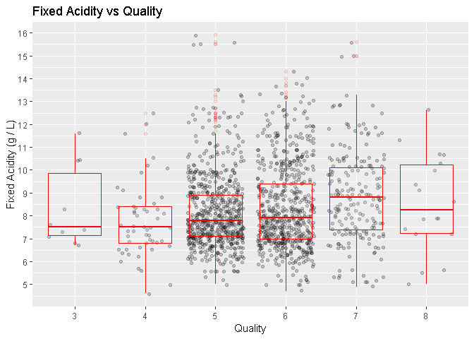
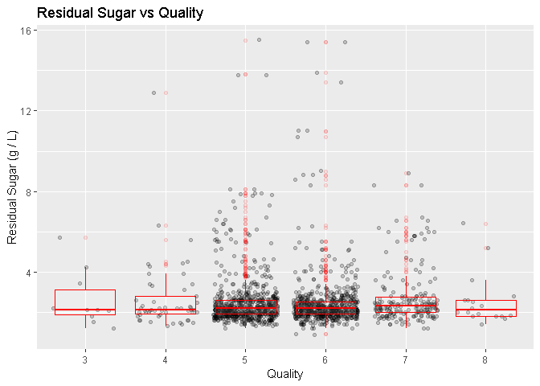
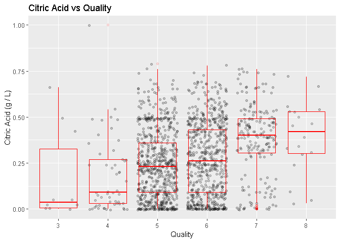
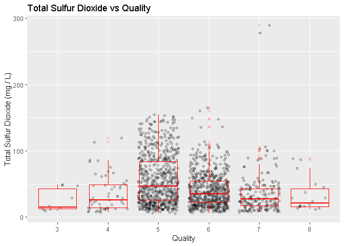
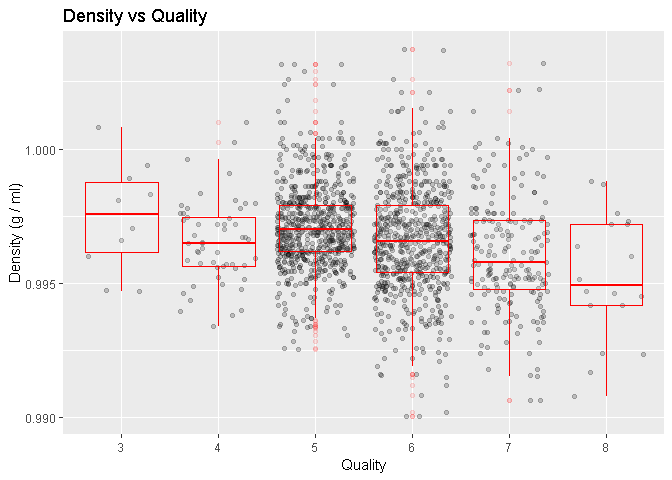
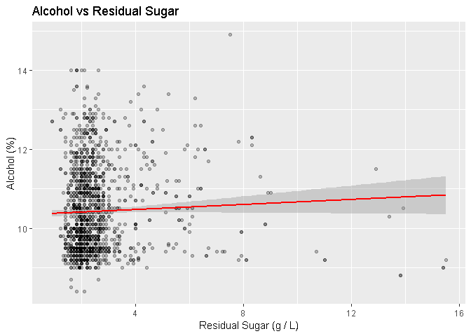
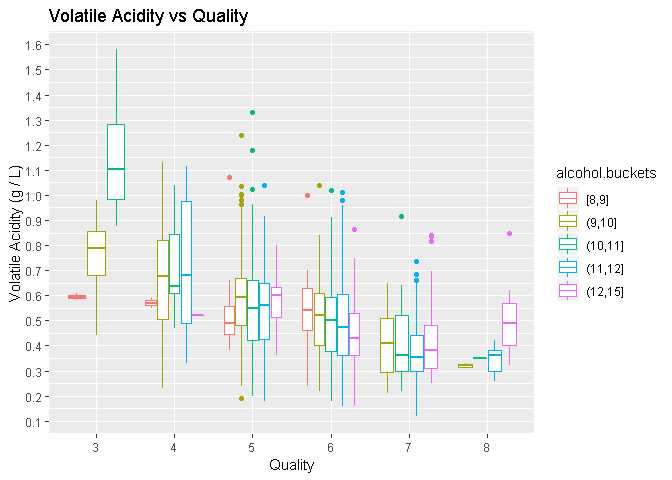

### This report explores the chemical attributes that affect the quality of red 
### wine for approximately 1600 wines.


### Reviewing the structure and datatypes of the dataset


```
##   fixed.acidity volatile.acidity citric.acid residual.sugar chlorides
## 1           7.4             0.70        0.00            1.9     0.076
## 2           7.8             0.88        0.00            2.6     0.098
## 3           7.8             0.76        0.04            2.3     0.092
## 4          11.2             0.28        0.56            1.9     0.075
## 5           7.4             0.70        0.00            1.9     0.076
## 6           7.4             0.66        0.00            1.8     0.075
##   free.sulfur.dioxide total.sulfur.dioxide density   pH sulphates alcohol
## 1                  11                   34  0.9978 3.51      0.56     9.4
## 2                  25                   67  0.9968 3.20      0.68     9.8
## 3                  15                   54  0.9970 3.26      0.65     9.8
## 4                  17                   60  0.9980 3.16      0.58     9.8
## 5                  11                   34  0.9978 3.51      0.56     9.4
## 6                  13                   40  0.9978 3.51      0.56     9.4
##   quality
## 1       5
## 2       5
## 3       5
## 4       6
## 5       5
## 6       5
```


```
## 'data.frame':	1599 obs. of  12 variables:
##  $ fixed.acidity       : num  7.4 7.8 7.8 11.2 7.4 7.4 7.9 7.3 7.8 7.5 ...
##  $ volatile.acidity    : num  0.7 0.88 0.76 0.28 0.7 0.66 0.6 0.65 0.58 0.5 ...
##  $ citric.acid         : num  0 0 0.04 0.56 0 0 0.06 0 0.02 0.36 ...
##  $ residual.sugar      : num  1.9 2.6 2.3 1.9 1.9 1.8 1.6 1.2 2 6.1 ...
##  $ chlorides           : num  0.076 0.098 0.092 0.075 0.076 0.075 0.069 0.065 0.073 0.071 ...
##  $ free.sulfur.dioxide : num  11 25 15 17 11 13 15 15 9 17 ...
##  $ total.sulfur.dioxide: num  34 67 54 60 34 40 59 21 18 102 ...
##  $ density             : num  0.998 0.997 0.997 0.998 0.998 ...
##  $ pH                  : num  3.51 3.2 3.26 3.16 3.51 3.51 3.3 3.39 3.36 3.35 ...
##  $ sulphates           : num  0.56 0.68 0.65 0.58 0.56 0.56 0.46 0.47 0.57 0.8 ...
##  $ alcohol             : num  9.4 9.8 9.8 9.8 9.4 9.4 9.4 10 9.5 10.5 ...
##  $ quality             : int  5 5 5 6 5 5 5 7 7 5 ...
```


```
##  fixed.acidity   volatile.acidity  citric.acid    residual.sugar  
##  Min.   : 4.60   Min.   :0.1200   Min.   :0.000   Min.   : 0.900  
##  1st Qu.: 7.10   1st Qu.:0.3900   1st Qu.:0.090   1st Qu.: 1.900  
##  Median : 7.90   Median :0.5200   Median :0.260   Median : 2.200  
##  Mean   : 8.32   Mean   :0.5278   Mean   :0.271   Mean   : 2.539  
##  3rd Qu.: 9.20   3rd Qu.:0.6400   3rd Qu.:0.420   3rd Qu.: 2.600  
##  Max.   :15.90   Max.   :1.5800   Max.   :1.000   Max.   :15.500  
##    chlorides       free.sulfur.dioxide total.sulfur.dioxide
##  Min.   :0.01200   Min.   : 1.00       Min.   :  6.00      
##  1st Qu.:0.07000   1st Qu.: 7.00       1st Qu.: 22.00      
##  Median :0.07900   Median :14.00       Median : 38.00      
##  Mean   :0.08747   Mean   :15.87       Mean   : 46.47      
##  3rd Qu.:0.09000   3rd Qu.:21.00       3rd Qu.: 62.00      
##  Max.   :0.61100   Max.   :72.00       Max.   :289.00      
##     density             pH          sulphates         alcohol     
##  Min.   :0.9901   Min.   :2.740   Min.   :0.3300   Min.   : 8.40  
##  1st Qu.:0.9956   1st Qu.:3.210   1st Qu.:0.5500   1st Qu.: 9.50  
##  Median :0.9968   Median :3.310   Median :0.6200   Median :10.20  
##  Mean   :0.9967   Mean   :3.311   Mean   :0.6581   Mean   :10.42  
##  3rd Qu.:0.9978   3rd Qu.:3.400   3rd Qu.:0.7300   3rd Qu.:11.10  
##  Max.   :1.0037   Max.   :4.010   Max.   :2.0000   Max.   :14.90  
##     quality     
##  Min.   :3.000  
##  1st Qu.:5.000  
##  Median :6.000  
##  Mean   :5.636  
##  3rd Qu.:6.000  
##  Max.   :8.000
```

### Input variables (based on physicochemical tests):  
1. fixed acidity (tartaric acid - g / dm^3)  
2. volatile acidity (acetic acid - g / dm^3)  
3. citric acid (g / dm^3)  
4. residual sugar (g / dm^3)  
5. chlorides (sodium chloride - g / dm^3  
6. free sulfur dioxide (mg / dm^3)  
7. total sulfur dioxide (mg / dm^3)  
8. density (g / cm^3)  
9. pH  
10. sulphates (potassium sulphate - g / dm^3)  
11. alcohol (% by volume)  
  
Output variable (based on sensory data):    
12. quality (score between 0 and 10)    
  

Note: grams/decimeter (g / dm^3)  
A decimeter cubed (dm^3) is equal to one liter (L)  
  
# Univariate Plots Section  
## Histograms of the above variables will be plotted below.

#### A histogram of each variable is plotted as well as a summary of the statistics

Checking for any 'na' values. No na values found.

```
##  [1] fixed.acidity        volatile.acidity     citric.acid         
##  [4] residual.sugar       chlorides            free.sulfur.dioxide 
##  [7] total.sulfur.dioxide density              pH                  
## [10] sulphates            alcohol              quality             
## <0 rows> (or 0-length row.names)
```

<!-- -->


```
##    Min. 1st Qu.  Median    Mean 3rd Qu.    Max. 
##    4.60    7.10    7.90    8.32    9.20   15.90
```

Fixed acidity in wine. The highest frequency of acidity is around 7 g/L. The plot looks like a normal distribution slightly skewed to the right with some outliers around 15 to 16 grams/L


<!-- -->

The amount of volative acidity is about a tenth of the fixed acidity. It appears to have bimodal distribution with peaks at 0.4 and 0.6 g/L.

<!-- -->


```
##    Min. 1st Qu.  Median    Mean 3rd Qu.    Max. 
##   0.000   0.090   0.260   0.271   0.420   1.000
```

From the distribution of the citric acid, over 150 wines have very little or no citric acid. This is the highest peak in the plot shows (zero) 0 g/L. The distribution of the citric acid is varied. Two other peaks that we see are around 0.25 and 0.48 g/L. The median is 0.26 g/L.


<!-- -->


```
##    Min. 1st Qu.  Median    Mean 3rd Qu.    Max. 
##   0.900   1.900   2.200   2.539   2.600  15.500
```

For the residual sugar, the distribution appears to be a very narrow normal distribution skewed to the right. The great majority of wines have a concentration of sugar 2.6 g/L and below. However, there are relatively few wines that have amounts up to 15.5 g/L. Wines greater than 45 g/L are considered sweet according to the database wine information. However, the maximum residual sugar shown is 15.5 g/L, so none of the wines are considered sweet. 

<!-- -->


```
##    Min. 1st Qu.  Median    Mean 3rd Qu.    Max. 
## 0.01200 0.07000 0.07900 0.08747 0.09000 0.61100
```

We also see for the chlorides content, the distribution appears to be a very narrow normal distribution skewed to the right. The great majority of wines (third quartile) have a concentration of chloride 0.09 g/L and below. However, there are relatively few wines that have amounts up to 0.611 g/L. 

<!-- -->


```
##    Min. 1st Qu.  Median    Mean 3rd Qu.    Max. 
##    1.00    7.00   14.00   15.87   21.00   72.00
```


<!-- -->


```
##    Min. 1st Qu.  Median    Mean 3rd Qu.    Max. 
##    6.00   22.00   38.00   46.47   62.00  289.00
```

We see the total median for free sulfur dioxide is 14 mg/L while the median for total sulfur dioxide is 38 mg/L.


<!-- -->


```
##    Min. 1st Qu.  Median    Mean 3rd Qu.    Max. 
##  0.9901  0.9956  0.9968  0.9967  0.9978  1.0037
```
The density of the wines are close to that of water, which is about 1 g/ml. The range of density values are from 0.99 to 1.0037 g/ml, which is unremarkable.

<!-- -->


```
##    Min. 1st Qu.  Median    Mean 3rd Qu.    Max. 
##   2.740   3.210   3.310   3.311   3.400   4.010
```

The plot of the pH has a general uniform distribution, although there are some outliers. The average and median are similar values of 3.3. This shows that the wine in the dataset on average is acidic.

<!-- -->


```
##    Min. 1st Qu.  Median    Mean 3rd Qu.    Max. 
##  0.3300  0.5500  0.6200  0.6581  0.7300  2.0000
```

The highest peaks on the plot is between 0.5 and 0.6 g/L.  Sulfates can affect the amount of Sulfur Dioxide in the wine. Some people are also none to be negatively affected by the sulfate content in red wines. 

<!-- -->


```
##    Min. 1st Qu.  Median    Mean 3rd Qu.    Max. 
##    8.40    9.50   10.20   10.42   11.10   14.90
```


```
## [1] "The mode is: 9.5"
```

The alcohol content plot is quite varied, but is skewed to the right. The range is from 8.4 to 14.90 percent alcohol. Note, however, that the median amount of alcohol content is 10.20. In addition, the greatest count is around 9.5 percent alcohol.  


<!-- -->


Count of Quality Scores

```
## 
##   3   4   5   6   7   8 
##  10  53 681 638 199  18
```


Although the scoring is between 0 and 10, the range of quality ratings is between 3 and 8 for the wines in this dataset. We see, however, that the great majority of the ratings chosen by the experts are 5 and 6.  
    
    
A subset of wines with high alcohol content was created to check if this has an effect on the quality rating. High content was choosen as wines with an alcohol content at and above the 90% quantile. The result was wines with an alcohol content of 12% or higher.  
  
The summary of the statistics for the high alcohol subset was printed below.  
  


```
##    Min. 1st Qu.  Median    Mean 3rd Qu.    Max. 
##   12.00   12.20   12.50   12.61   12.80   14.90
```
    
   
   Percentages of each quality ratings of the whole dataset (top) vs the high alcohol content subset.

```
## 
##          3          4          5          6          7          8 
##  0.6253909  3.3145716 42.5891182 39.8999375 12.4452783  1.1257036
```

```
## 
##         4         5         6         7         8 
##  1.234568  7.407407 45.061728 40.740741  5.555556
```

    
The percentages of quality ratings calculated.The whole dataset is shown first and the high content wines are shown second. As we see above, there is an effect. For high content wines, only 7.4% received a rating of 5, 45.1% received a rating of 6, while 40.7% received a rating of 7. Compared the whole database, 42.6% of the wine received a rating of 5 and 39.9% received a rating of 6, and only 12.4% received a rating of 7.
    
    
A variable was created to check the sugar to chlorides (salt) ratio. The great majority of wines show a ratio of sugar to salt between 20 to 35. 


<!-- -->


```
##    Min. 1st Qu.  Median    Mean 3rd Qu.    Max. 
##   2.946  23.656  28.378  32.013  34.352 238.889
```
  

# Univariate Analysis

### What is the structure of your dataset?
The original data consist of 12 variables and 1,599 observations. The data types are 10 numerical and 2 integer variables. An additional variable called sugar_to_chlorides was created to verify this ratio among the wines.

The  wines attributes are generally acid, sugar, salt, sulfur dioxide and sulphates, density, and, of course, alcohol amount. 
acid - fixed acidity, volative acidity, pH
sugar - residual sugar
salt - sodium chloride
sulfur dioxide - free and total sulfur dioxide
sulphates - postassium sulphate
alcohol
quality

### What is/are the main feature(s) of interest in your dataset?
The main features are alcohol and quality rating. However, we will look at others to see the affect on the wine quality. 

### What other features in the dataset do you think will help support your investigation into your feature(s) of interest?
I think sugar content, acidity and sulfur content will also affect the quality rating.

### Did you create any new variables from existing variables in the dataset?
Yes. A variable was created to check the sugar to chlorides (salt) ratio. The great majority of wines show a ratio of sugar to salt between 20 to 35. However, there were some outliers up to 238.8.

### Of the features you investigated, were there any unusual distributions? Did you perform any operations on the data to tidy, adjust, or change the form of the data? If so, why did you do this?
The distribution of citric acid was alternating and varied. The largest peak was near the zero content value, however, there were other peaks. I was surprised that most of the wines only had a rating of 5 or 6 and not higher. In addition, the distributions for the residual sugar and salt looked similar even though the actual values were very different. No. I did not have to tidy or adjust the data. 


# Bivariate Plots Section

We calculated the correlation of the dataset to help determine which variables affect the quality and other variables. The created variable sugar_to_chlorides was removed.
  

  


```
##                      fixed.acidity volatile.acidity citric.acid
## fixed.acidity                1.000           -0.256       0.672
## volatile.acidity            -0.256            1.000      -0.552
## citric.acid                  0.672           -0.552       1.000
## residual.sugar               0.115            0.002       0.144
## chlorides                    0.094            0.061       0.204
## free.sulfur.dioxide         -0.154           -0.011      -0.061
## total.sulfur.dioxide        -0.113            0.076       0.036
## density                      0.668            0.022       0.365
## pH                          -0.683            0.235      -0.542
## sulphates                    0.183           -0.261       0.313
## alcohol                     -0.062           -0.202       0.110
## quality                      0.124           -0.391       0.226
##                      residual.sugar chlorides free.sulfur.dioxide
## fixed.acidity                 0.115     0.094              -0.154
## volatile.acidity              0.002     0.061              -0.011
## citric.acid                   0.144     0.204              -0.061
## residual.sugar                1.000     0.056               0.187
## chlorides                     0.056     1.000               0.006
## free.sulfur.dioxide           0.187     0.006               1.000
## total.sulfur.dioxide          0.203     0.047               0.668
## density                       0.355     0.201              -0.022
## pH                           -0.086    -0.265               0.070
## sulphates                     0.006     0.371               0.052
## alcohol                       0.042    -0.221              -0.069
## quality                       0.014    -0.129              -0.051
##                      total.sulfur.dioxide density     pH sulphates alcohol
## fixed.acidity                      -0.113   0.668 -0.683     0.183  -0.062
## volatile.acidity                    0.076   0.022  0.235    -0.261  -0.202
## citric.acid                         0.036   0.365 -0.542     0.313   0.110
## residual.sugar                      0.203   0.355 -0.086     0.006   0.042
## chlorides                           0.047   0.201 -0.265     0.371  -0.221
## free.sulfur.dioxide                 0.668  -0.022  0.070     0.052  -0.069
## total.sulfur.dioxide                1.000   0.071 -0.066     0.043  -0.206
## density                             0.071   1.000 -0.342     0.149  -0.496
## pH                                 -0.066  -0.342  1.000    -0.197   0.206
## sulphates                           0.043   0.149 -0.197     1.000   0.094
## alcohol                            -0.206  -0.496  0.206     0.094   1.000
## quality                            -0.185  -0.175 -0.058     0.251   0.476
##                      quality
## fixed.acidity          0.124
## volatile.acidity      -0.391
## citric.acid            0.226
## residual.sugar         0.014
## chlorides             -0.129
## free.sulfur.dioxide   -0.051
## total.sulfur.dioxide  -0.185
## density               -0.175
## pH                    -0.058
## sulphates              0.251
## alcohol                0.476
## quality                1.000
```

Interestingly, with a value of 0.014 residual sugar does not show a strong correlation with quality. In addition,pH only shows a -0.058 effect. 

### Correlation Plot
<!-- -->
  
--------------------------------------------------------------------------------
    
A linear regression equation was used to determine the correlation coefficient to 
verify three independent variables that greatly influence the quality rating. 
These variables are alcohol, sulphates, and volatile acidity.

#### Linear Regression Equation ( three significant variables)


```
## 
## Calls:
## rwine.M1: lm(formula = quality ~ alcohol, data = rwine)
## rwine.M2: lm(formula = quality ~ alcohol + sulphates, data = rwine)
## rwine.M3: lm(formula = quality ~ alcohol + sulphates + volatile.acidity, 
##     data = rwine)
## 
## ===========================================================
##                      rwine.M1     rwine.M2     rwine.M3    
## -----------------------------------------------------------
##   (Intercept)          1.875***     1.375***     2.611***  
##                       (0.175)      (0.177)      (0.196)    
##   alcohol              0.361***     0.346***     0.309***  
##                       (0.017)      (0.016)      (0.016)    
##   sulphates                         0.994***     0.679***  
##                                    (0.102)      (0.101)    
##   volatile.acidity                              -1.221***  
##                                                 (0.097)    
## -----------------------------------------------------------
##   R-squared            0.227        0.270        0.336     
##   N                 1599         1599         1599         
## ===========================================================
##   Significance: *** = p < 0.001; ** = p < 0.01;   
##                 * = p < 0.05
```
  
When we calculated the correlation coefficient for alcohol only.  


```
## [1] "The correlation coefficient is:  0.475"
```

Then we calculated the correlation coefficient for the three variables.  


```
## [1] "The correlation coefficient is:  0.579"
```

It appears that the alcohol content has the most influence on quality with a correlation coefficient of 47.5%.   


## Bivariate Plots of Variables vs Quality  
  
--------------------------------------------------------------------------------

### Plots with jitter (overlayed with boxplots) for the variables vs quality (rating) 

We will use boxplots to see the overall trend of the various variables vs the quality rating.

<!-- -->

The plot above shows that the wines that received the higher quality ratings had a higher alcohol content. Except for the rating value of 5, the plot shows a positive trend where the quality rating tend to increase as the alcohol content increases.


<!-- -->

The plot above shows a positive trend for the amount sulphates vs the quality rating the wines received. 


<!-- -->

On average, there appears to be a negative relationship between the volatile acidity and quality rating. The lower the volatile acidity, the higher the quality rating the wine receives.

<!-- -->

The trend of fixed acidity and the quality is not consistent, so we cannot state a direct relationship between the two variables


<!-- -->

It appears  that the residual sugar does not have much affect on the quality of the wine as the trend generally remains level.

<!-- -->

We do see an affect of the pH on the quality of the wine. The less the pH value, the better quality rating the wine receives. 


<!-- -->

Citric acid has a positive affect on the quality of the wine. The more citric acid the better rating the wine receives. 


<!-- -->

There is a slight negative trend for the chlorides content in the wines.


<!-- -->

Interestingly, the total Sulfur dioxide has a slight concave trend. The amount of total sulfur dioxide increases until quality rating of 5 and then it decreases until 8. We may have to research further to see if there is coincidence with free sulfur dioxide or amount of sulphates. 


<!-- -->

Although there appears to be a slight negative relationship between quality and density, on average the actual range of values is only about 0.0025 difference between the highest and lowest rating.

--------------------------------------------------------------------------------

We then plot scatterplots of the significant variables with a trend line. Since they are quantitative variables, scatterplots are appropriate.


<!-- -->

There does not seem to be much correlation between the alcohol content and the amount of residual sugar. Most of the wines have a residual sugar amount between 1.5 and 3 g/L regardless of alcohol content. 


<!-- -->

We see that as the fixed acidity decreases the pH increases, which makes sense since higher pH values result from less acidic liquids.

<!-- -->

Although, the data is significantly dispersed in the graph, the trend line shows a positive, although not strong, relationship between pH and volatile acidity.


<!-- -->

There is a negative and moderate relationship between the volatile acidity and citric acid.

# Bivariate Analysis

### Talk about some of the relationships you observed in this part of the investigation. How did the feature(s) of interest vary with other features in the dataset?

I separately looked into the relationship between quality and several attributes to get an idea of what really affects the quality scores the wines received. I used the correlation results to help guide the attributes I reviewed. The attributes were alcohol content, Sulphates, citric acid, total Sulfur dioxide, volatile acidity, and chlorides. The alcohol content seemed like an obvious attribute to explore. The amount of Sulphates and volatile acidity also show a significant influence on the quality rating. Below is an overview of the attributes direct affect the quality score on average: 

.	Alcohol vs Quality - generally positive trend except for quality score 5 wines, which showed the lowest alcohol content  
.	Sulphates vs Quality - weak positive trend  
.	Volatile Acidity vs Quality - negative trend  
.	Fixed Acidity vs Quality - not consistent/no affect  
.	Residual Sugar vs Quality - neutral level/no affect  
.	pH vs Quality - negative trend  
.	Citric Acid vs Quality - positive trend  
.	Chlorides vs Quality - very weak negative trend  
.	Total Sulfur Dioxide vs Quality rating - upward trend until quality score 5 and then downwards  


### Did you observe any interesting relationships between the other features (not the main feature(s) of interest)?

I explored the relationship between Residual Sugar and Quality. Surprisingly, there did not appear to be an affect. I also explored the pH to fixed and volatile acidity. The fixed acidity trending downwards with an increase in pH made sense. However, for the volatile acidity, there did not seem to be a direct influence of the pH.

### What was the strongest relationship you found?
Actually, the strongest relationship I found was alcohol content vs quality


# Multivariate Plots Section

From the exploration and analysis so far, it appears that the most influencing factors are alcohol content, the amount of Sulphates, volatile aciditiy and even citric acid. We will review them further. 

---------------------------------------------------------------------------------

Since alcohol is a quantitative variable, We created a variable called alcohol.buckets and separated the variable into different alcohol ranges or bins. This was to better determine the effect and trends with the other variables. 


```
## 
##   [8,9]  (9,10] (10,11] (11,12] (12,15] 
##      37     710     444     267     141
```

We verified the bin ranges. We see that for wines with alcohol content more that 10% and less than or equal to 11%, the count is 444 wines.
  

```
##   [8,9]  (9,10] (10,11] (11,12] (12,15] 
##      37     710     444     267     141
```
  

```
## [1] 444
```
NOTE: The bin values range from greater than the lower limit to inclusive of the upper limit.
  
  

We also created bins for sulphates amounts. We used the statistics values to help determine how to separate the bin ranges.


```
##    Min. 1st Qu.  Median    Mean 3rd Qu.    Max. 
##  0.3300  0.5500  0.6200  0.6581  0.7300  2.0000
```


```
## sulphates.buckets
##  [0.33,0.55] (0.55,0.658] (0.658,0.73]     (0.73,2] 
##          420          544          249          386
```

<!-- -->

This plot shows that on average the amount of Sulphates is greater in wines with higher ratings despite the alcohol content. However, it shows that wines that received a quality rating of 3, have an alcohol content below 11%. In addition, the Sulphates amount was about 0.75 g/L at the most except for wines of more than 9.0% to 10% alcohol content. These wines when having a rating of 8 had the highest Sulphate amount of about 0.95 g/L.

<!-- -->

As we seen the wines with lower volatile acidity received the highest ratings regardless of alcohol content. The wines with a rating of 8 had a volatile acidity of approximately 0.3 g/L to 0.5 g/L except for wines with greater than 12% alcohol content.
  
    
The range of the pH values are shown below.

```
## [1] 2.74 4.01
```


<!-- -->

An overview plot of the wines with a pH of 3 and 4 (when rounded) is shown above. We see that  more acidic wines (pH ~ 3) had less volatile acidity for each rating compared to wines with less acidic wines. Generally, for wines with a rounded pH value of 3, the volatile acidity ranged from about 0.35 g/L to 0.8 g/L while wine with a rounded pH value of 4 ranged from about 0.5 g/L to 1.2 g/L.

<!-- -->

We then look at the influence of citric acid and alcohol. It appears that the two highest rated wines (7 and 8) shows a citric acid amount ranged from about 0.35 g/L to less than 0.55 g/L While the lower rated wines had a lower amount except for wines with an alcohol content between 8 and 9%. Two of the lower rated wines (3 and 5) had a citric acid amount of about 0.58 and 0.45, respectively.

<!-- -->

The plot of fixed acidity and citric acid is shown above as well as the quality rating. On average, we see a positive relationship between fixed acidity and citric acid, and a negative relationship between the alcohol content and fixed acidity.

<!-- -->

The plots reflect that on average that wines with lower Sulphates amounts have higher volatile acidity. The rightmost plot also showed a general trend line.


<!-- -->

In the plot above, it appears that on average, the higher the Sulphates amount, the higher the citric acid. In addition, there is a slight increase with higher alcohol content except for the highest Sulfates level, which shows a decrease. We see that there is great increase with alcohol content with one of the Sulphates ranges of 0.658 to 0.73.

--------------------------------------------------------------------------------
  
    
    
# Multivariate Analysis

### Talk about some of the relationships you observed in this part of the investigation. Were there features that strengthened each other in terms of looking at your feature(s) of interest?

Upon review, we see that  more acidic wines (pH ~ 3) had less volatile acidity for each rating 
compared to wines with less acidic wines. In addition, wines with less volatility had higher 
amounts of Sulphates.

Another relationship was that between citric acid and Sulphates. Overall, wines with higher 
amounts of citric acid also had higher amounts of Sulphates. In addition, on average these 
amounts for both substances increase with an increase of alcohol content.

### Were there any interesting or surprising interactions between features?

It appears that as the volatile acidity decreases the quality rating increases despite the alcohol content.

  
------

# Final Plots and Summary

### Plot One
<!-- -->

### Description One

The plot above shows that the wines that received the higher quality ratings had a higher alcohol content. Except for the rating value of 5, the plot shows a positive trend where the quality rating tend to increase as the alcohol content increases.

### Plot Two
<!-- -->

### Description Two

In the plot above, it appears that on average, the higher the Sulphates amount, the higher the citric acid. In addition, there is a slight increase with higher alcohol content except for the highest Sulfates level, which shows a decrease. We see that there is great increase with alcohol content with one of the Sulphates ranges of 0.658 to 0.73.

### Plot Three
<!-- -->

### Description Three


The plot of fixed acidity and citric acid is shown above as well as the quality rating. On average, we see a positive relationship between fixed acidity and citric acid, and a negative relationship between the alcohol content and fixed acidity.

------

# Reflection

Wines greater than 45 g/L are considered sweet according to the database wine information. However, the maximum residual sugar shown is 15.5 g/L, so none of the wines are considered sweet. The attribute residual sugar did not seem to have a significant influence on the quality score of the wine. Maybe wines with a higher or more detectable residual sugar content would be more likeable and have more affect on the quality of the wines. 

From the analysis of this particular dataset, the alcohol content appears to be the most significant variable influencing the quality rating given to the wine. Overall, there is a positive relationship between these two variables. The other sigificant variables were citric acid, volatile acidity, amount of Sulphates, and fixed acidity. Overall, the wines with the highest quality ratings have higher alcohol content, higher amounts of Sulphates, lower volatile acidity, lower fixed acidity, and higher citric acid. It appears that various acidity measures are significant to the wine quality.

The analysis had several seemingly influencing variables and there was some difficulty with deciding which ones to focus on and which to compare with each other. Using the correlation function and linear regression helped with these decisions.  This analysis would be enriched with variables like the weather, the region the grapes were grown or the wine was made, and the year in which the wine was made.

Sources:   
+ stackoverflow.com  
+ r-blogger.com  
+ youtube.com  
+ http://kbroman.org/knitr_knutshell/pages/Rmarkdown.html  
+ http://www.sthda.com/english/wiki/visualize-correlation-matrix-using-correlogram  
+ https://rstudio.github.io/dygraphs/r-markdown.html  


